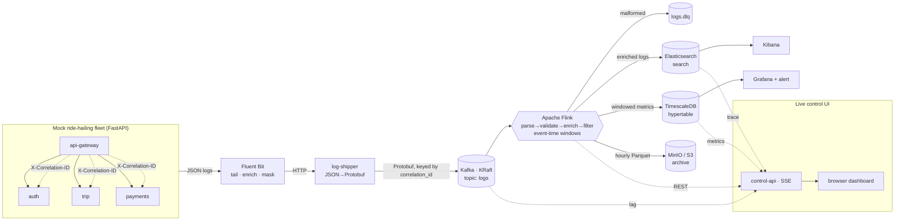

# Distributed Logging & Observability Platform

An end-to-end streaming pipeline that ingests logs from mock microservices,
buffers them through **Kafka**, processes them in real time with **Apache Flink
(Java)**, and routes them to three storage backends for **search, metrics, and
archival** — with full request tracing by `correlation_id` and a live control UI.

Built to demonstrate backend + distributed-systems engineering: exactly-once
stream processing, event-time windowing, schema-typed messaging, and horizontal
scale via Kafka partitions and Flink task slots.

## Architecture



## Pipeline stages

| Stage | What | Docs |
|---|---|---|
| 1 | Mock microservices + load generator (correlation-id propagation) | [services/README.md](services/README.md) |
| 2 | Fluent Bit → Protobuf → Kafka (KRaft) | [docs/STAGE2.md](docs/STAGE2.md) |
| 3 | Flink job: validate/DLQ, enrich, filter, event-time windows, checkpointing | [docs/STAGE3.md](docs/STAGE3.md) |
| 4–5 | Elasticsearch / TimescaleDB / MinIO + Kibana & Grafana | [docs/STAGE4_5.md](docs/STAGE4_5.md) |
| 6 | docker-compose + k8s + benchmark | this file, [k8s/README.md](k8s/README.md) |
| 7 | Live control UI + metrics API | [docs/STAGE7.md](docs/STAGE7.md) |

## Tech stack
Python 3.12 (FastAPI) · Fluent Bit · Protobuf · Apache Kafka 3.8 (KRaft) ·
Apache Flink 1.18 (Java 17, DataStream API) · Elasticsearch 7.17 + Kibana ·
TimescaleDB · MinIO (S3) + Parquet · Grafana · Docker Compose · Kubernetes.

## Run it

> **Resource note.** The full stack is JVM-heavy (Kafka + Flink JM/TM + ES +
> TimescaleDB + MinIO + fleet). It wants **~10–12 GB of Docker memory**. On a
> smaller machine use the metrics-only smoke profile below, or deploy to a
> cluster.

```bash
# Full stack (needs ~12GB Docker RAM)
docker compose up -d --build
#  UI:      http://localhost:8090     (live control dashboard)
#  Grafana: http://localhost:3000     (admin/admin)
#  Kibana:  http://localhost:5601
#  Flink:   http://localhost:8081

# Generate traffic
docker compose --profile load up -d loadgen         # controllable daemon
# or one-shot from the host:
python services/loadgen/load_generator.py --rps 300 --duration 60

# Metrics-only smoke profile (fits ~4GB: drops ES + Parquet sinks)
docker compose -f docker-compose.yml -f docker-compose.smoke.yml up -d --build \
  kafka kafka-init timescaledb auth trip payments api-gateway \
  fluent-bit log-shipper flink-jobmanager flink-taskmanager

# Scale profile (6 Kafka partitions, 2 TaskManagers × 4 slots, bigger heaps)
docker compose -f docker-compose.yml -f docker-compose.full.yml up -d --build
```

Trace one request end-to-end:
```bash
CID=$(curl -s -D - -o /dev/null -XPOST localhost:8000/rides/request \
      -H 'content-type: application/json' -d '{"user_id":"u1"}' \
      | awk 'tolower($1)=="x-correlation-id:"{print $2}' | tr -d '\r')
curl -s "localhost:9200/logs-*/_search?q=correlation_id:$CID"   # all 4 services
```

Benchmark (writes `bench/results.json` + `bench/RESULTS.md`):
```bash
docker compose --profile load up -d loadgen control-api
python bench/benchmark.py --steps 500,1000,2000,4000 --hold 45
```

## Measured (verified on this build)

Run on a constrained laptop (Docker VM 3.8 GB, Flink image amd64 under emulation),
so these validate **correctness**, not peak throughput — use `bench/` on a real
box for headline numbers.

- **Correlation-id propagation**: one request → the *same* id in all 4 services' logs.
- **Log mix** (~3.6k lines): INFO 76.6 % · DEBUG 15.1 % (sampled) · WARN 6.9 % · ERROR 1.4 %.
- **Kafka**: 2,721 Protobuf messages produced, 0 errors, evenly across 3 partitions;
  `user_id` masked at the edge; 0 correlation-ids split across partitions (ordering holds).
- **Flink → TimescaleDB** (end-to-end, verified): 16 tumbling + 74 sliding metric
  rows; per-service avg latency api-gateway ~253 ms, payments ~68 ms, trip ~39 ms,
  auth ~14 ms; error rates 0.8–2.1 %.
- **Flink → Elasticsearch**: enriched docs indexed under the `logs-*` mapping;
  `correlation_id` trace search returns the request across services.
- **Grafana**: reads the live per-service metrics through the provisioned datasource;
  error-rate alert (`>2 % for 5 m`) provisioned.
- Two real Flink bugs were found by running it and fixed (Avro/Kryo serialization;
  missing `hadoop-mapreduce-client-core`) — see [docs/STAGE4_5.md](docs/STAGE4_5.md).

## Repo layout
```
services/     mock fleet + load generator        proto/        shared Protobuf schema
fluent-bit/   tail + mask + ship config          log-shipper/  JSON→Protobuf→Kafka bridge
flink-job/    Java Flink job (Maven, Docker)     storage/      ES mapping, TSDB init, archive query
dashboards/   Grafana provisioning + dashboard   control-api/  metrics API (SSE)
ui/           single-page live control UI        k8s/          Kubernetes manifests
bench/        benchmark harness                  docs/         per-stage deep-dives + interview Q&A
```
