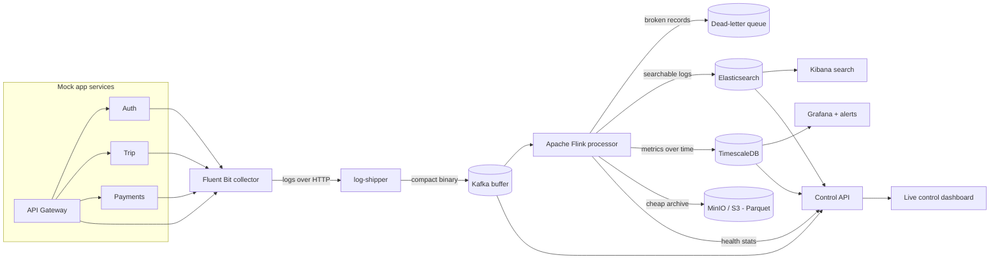

# Real-Time Distributed Logging & Observability Platform

*Apache Kafka · Apache Flink (Java) · Elasticsearch · TimescaleDB · MinIO · Kubernetes*

---

## What is this, in plain English?

Imagine a ride-hailing app like Uber. Every time you request a ride, that one tap
quietly touches several different services behind the scenes — one checks you're
logged in, one finds a driver, one charges your card. Each of those services is
constantly writing little diary entries ("logs") about what it's doing.

When something goes wrong, an engineer has to answer: *"What happened to **this
one** request?"* — but the clues are scattered across many services, each writing
thousands of lines a second. Finding the story of a single request is like pulling
one specific receipt out of a hurricane of paper.

**This project builds the system that tames that hurricane.** It collects every
log from every service, stamps each request with a unique tracking number,
processes the flood in real time, and files everything into the right place so you
can instantly answer questions like *"show me everything that happened to request
#abc123"* or *"is the payments service failing more than usual right now?"*

Think of it as a combination of a **package-tracking system** (follow one request
end to end) and a **security control room** (live dashboards showing the health of
everything at once).

---

## The one idea that makes it all work: the tracking number

When a request first arrives, the system gives it a unique ID (a "correlation ID")
and **passes that same ID along to every service the request touches**. Every log
line that request produces — no matter which service wrote it — carries that ID.

So instead of searching four separate piles of logs and guessing which lines go
together, you type in one ID and see the request's entire journey, in order,
across every service. That's the headline feature.

---

## How the pieces fit together



**Reading the diagram left to right:** the app services do their work and write
logs → a collector picks the logs up → they're packed into a compact format and
put onto a conveyor belt (Kafka) → a real-time processor (Flink) cleans, enriches,
and summarizes them → and the results are filed into three different stores, each
good at a different job. Dashboards and a live control panel sit on top.

---

## The journey of a single log line (step by step)

1. **A service writes a log.** The four mock services (gateway, auth, trip,
   payments) behave like a real app: mostly normal activity, some warnings, the
   occasional error spike — every line tagged with the request's tracking ID.
2. **A collector picks it up.** *Fluent Bit* tails the log files, adds useful
   context (which machine), and hides sensitive fields (like user IDs) before
   they ever leave.
3. **It gets packed onto a buffer.** A small "shipper" converts each log into a
   compact binary format (*Protobuf* — smaller and faster than plain text) and
   drops it onto *Kafka*. Kafka is the shock absorber: if a traffic spike hits,
   logs pile up safely here instead of crashing anything downstream.
4. **A real-time engine processes it.** *Apache Flink* reads the stream and, in
   order: checks each record is valid (broken ones are set aside, not lost),
   adds derived info, drops noisy debug chatter while keeping every error, and
   continuously calculates per-service stats (error rate, average speed).
5. **It's filed into three stores**, each chosen for what it's good at:
   - **Elasticsearch** — for *searching* ("find this request / this error").
   - **TimescaleDB** — for *trends over time* (the graphs).
   - **MinIO/S3 as Parquet** — cheap long-term *archive* you can query later.
6. **Humans see it.** *Kibana* to search and trace a request; *Grafana* for
   trend graphs and an alert that fires when errors get too high; and a custom
   **live control dashboard** where you can turn the traffic dial up, trigger a
   fake outage, and watch the whole system react in real time.

---

## Why build it this way? (the engineering, briefly)

- **A buffer in the middle (Kafka)** means producers and consumers don't depend on
  each other's speed — a spike is absorbed, nothing is lost, and you can even
  "rewind" and reprocess history.
- **Real-time stream processing (Flink)** computes results continuously instead of
  in slow nightly batches, and does it *exactly once* even if a machine crashes.
- **Three specialized stores** beat one do-everything database: search, trends,
  and cheap archive are genuinely different jobs.
- **It's built to scale**: add Kafka "lanes" (partitions) and Flink workers (task
  slots) to handle more traffic — the same way a real company would grow it.

---

## Pipeline stages (and where to read more)

| Stage | What it adds | Deep-dive + interview Q&A |
|---|---|---|
| 1 | Mock services + load generator + the tracking-ID system | [services/README.md](services/README.md) |
| 2 | Collector → compact binary format → Kafka buffer | [docs/STAGE2.md](docs/STAGE2.md) |
| 3 | The Flink real-time processor (the heart of the project) | [docs/STAGE3.md](docs/STAGE3.md) |
| 4–5 | The three stores + Kibana & Grafana dashboards | [docs/STAGE4_5.md](docs/STAGE4_5.md) |
| 6 | One-command startup, Kubernetes, benchmark | this file + [k8s/README.md](k8s/README.md) |
| 7 | The live control dashboard | [docs/STAGE7.md](docs/STAGE7.md) |

---

## Tech stack

Python 3.12 (FastAPI) · Fluent Bit · Protobuf · Apache Kafka 3.8 (KRaft, no
ZooKeeper) · Apache Flink 1.18 (Java 17, DataStream API) · Elasticsearch 7.17 +
Kibana · TimescaleDB · MinIO (S3-compatible) + Parquet · Grafana · Docker Compose
· Kubernetes.

---

## Run it yourself

> **Heads-up on memory.** The full system runs a lot of heavy Java services at
> once (Kafka, Flink, Elasticsearch, and more). It comfortably needs about
> **10–12 GB of memory given to Docker**. On a smaller laptop, use the lightweight
> "smoke" profile below, which runs the core pipeline in about 4 GB.

**Full system** (needs ~12 GB Docker memory):
```bash
docker compose up -d --build
#  Live dashboard: http://localhost:8090
#  Grafana:        http://localhost:3000   (login admin / admin)
#  Kibana:         http://localhost:5601
#  Flink UI:       http://localhost:8081
```

**Send it some traffic:**
```bash
# simple one-shot: 300 requests/sec for 60 seconds
python services/loadgen/load_generator.py --rps 300 --duration 60
```

**Lightweight profile** (fits ~4 GB — runs the core Kafka→Flink→TimescaleDB path):
```bash
docker compose -f docker-compose.yml -f docker-compose.smoke.yml up -d --build \
  kafka kafka-init timescaledb auth trip payments api-gateway \
  fluent-bit log-shipper flink-jobmanager flink-taskmanager
```

**Scale profile** (for a big machine: more Kafka lanes + more Flink workers):
```bash
docker compose -f docker-compose.yml -f docker-compose.full.yml up -d --build
```

**Trace one request across every service** (the headline demo):
```bash
CID=$(curl -s -D - -o /dev/null -XPOST localhost:8000/rides/request \
      -H 'content-type: application/json' -d '{"user_id":"u1"}' \
      | awk 'tolower($1)=="x-correlation-id:"{print $2}' | tr -d '\r')
curl -s "localhost:9200/logs-*/_search?q=correlation_id:$CID"   # same id, all 4 services
```

**Measure performance** (writes `bench/RESULTS.md`):
```bash
docker compose --profile load up -d loadgen control-api
python bench/benchmark.py --steps 500,1000,2000,4000 --hold 45
```

---

## What actually works (honestly verified)

I built and tested this on a memory-limited laptop, so these results prove the
system is **correct and working end-to-end** — not its top speed. (For headline
throughput numbers, run `bench/` on a machine with more memory.)

- **Request tracing works:** one request produced the *same* tracking ID in all
  four services' logs, so a single search reconstructs its full journey.
- **Realistic log traffic:** across ~3,600 log lines — 76.6% info, 15.1% debug
  (sampled), 6.9% warnings, 1.4% errors, just like a real system.
- **Reliable buffering:** 2,721 records flowed through Kafka with **0 errors**,
  evenly spread across lanes; sensitive user IDs were masked before storage; and
  every request's logs stayed correctly ordered.
- **Real-time processing verified end-to-end:** Flink turned the raw stream into
  live per-service metrics in TimescaleDB (average response times ranged from
  ~14 ms for auth to ~253 ms for the gateway; error rates 0.8–2.1%).
- **Search + dashboards work:** logs are searchable in Elasticsearch by tracking
  ID; Grafana shows live per-service graphs with an alert that fires when errors
  exceed 2%.
- **Battle-tested:** running it for real surfaced two genuine bugs (a data
  serialization mismatch and a missing dependency), both diagnosed from the logs
  and fixed — see [docs/STAGE4_5.md](docs/STAGE4_5.md).

---

## What's in the repo

```
services/     the four mock app services + the load generator
proto/        the shared message format definition
fluent-bit/   log collector config (tail, add context, mask secrets)
log-shipper/  converts logs to binary and puts them on Kafka
flink-job/    the Java real-time processor (the core of the project)
storage/      Elasticsearch mapping, TimescaleDB setup, archive query examples
dashboards/   ready-made Grafana dashboard + alert
control-api/  backend that powers the live dashboard
ui/           the single-page live control dashboard
k8s/          Kubernetes deployment files
bench/        performance measurement script
docs/         plain-English deep-dives + interview Q&A for each stage
```
